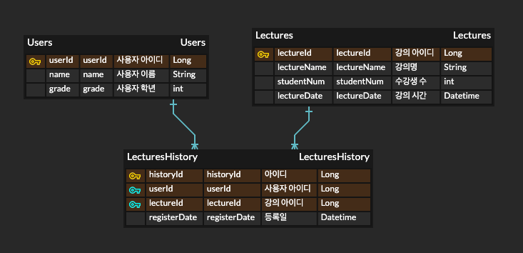

# [항해플러스 백엔드 5기] 2주차 과제 - 특강 신청 서비스

## [기술스택]
- Framework : Spring Boot
- Java : 17
- Database : H2 Database
- build tool : gradle

## [요구사항]

1. 특강 신청 API `POST /lectures/apply`

    - 특정 userId로 선착순으로 제공되는 특강을 신청하는 API를 작성
    - `동일한 신청자는 한 번의 수강 신청`만 성공할 수 있음 ➡️ 같은 사용자에게 여러번 특강 슬롯이 제공되지 않도록 주의
    - 각 강의는 `선착순 30명만 가능`(Service 기준 선착순)
    - 이미 신청자가 30명이 초과되면 이후 신청자는 요청에 실패
    - 어떤 유저가 `특강을 신청했는지 히스토리 저장`

    
2. 특강 선택 API `GET /lectures`

    - 날짜별로 특강이 존재할 수 있는 범용적 서비스(일회성X)
    - 이를 수용하기 위해, `특강 엔티티의 경우 기본 과제 SPEC을 만족하는 설계에서 변경`되어야 함
        - 수강신청 API 요청 및 응답 또한 이를 잘 수용할 수 있는 구조로 변경 가능
    - 특강의 정원은 30명으로 고정, 사용자는 `각 특강에 신청하기전 목록을 조회`해볼 수 있어야 함
        - 추가로 `신청 정원이 특강마다 다르다면` 어떻게 처리할지

3. 특강 신청 완료 여부 조회 API `GET /lectures/application/{userId}`
    - 특정 userId로 `특강 신청 완료 여부를 조회`하는 API를 작성
    - 특강 신청에 성공한 사용자 ➡️ 성공, 특강 등록자 명단X 사용자 ➡️ 실패 [True, False]

## [평가 기준]
1. STEP_03
    - `ERD 작성`의 당위성 여부
    - 아래 `3가지 API 구현 여부`
      - 특강 신청 API
      - 특강 신청 여부 조회 API
      - 특강 선택 API
    - 적절한 형태의 추상화를 통해 `DB 의존성과 비지니스 로직을 격리`했는지
      - Domain Model 패턴(JPA, TypeORM)의 형태로 작성한 경우, Application Layer와 같이 비지니스 로직이 적절히 보호되는 형태의 아키텍처를 적용했는지
      - 도메인과 DB를 분리하는 형태의 아키텍처로 작성한 경우, 도메인 로직이 Datasource Layer와 같은 의존 계층으로부터 보호되는 형태의 아키텍처를 적용했는지

2. STEP_04
    - `동시성 이슈`에 대해 고려되었는지 ➡️ **각 강의별 최대 30명만 요청**
      - DB 락(낙관/비관) / 분산 락 등과 같이 다수의 서버 인스턴스 환경에서도 동시성 문제가 제어 가능하도록 로직을 구현하였는지
    - `확장 가능한 엔티티 구조`를 고려했는지 ➡️ **강의와 각 강의별 날짜가 추가 가능한 구조의 DB구현**
      - 특강 테이블, 신청 히스토리 테이블에 대한 구조
      - 적절히 각 도메인에 대한 서비스의 책임이 분리되었는지(단일책임원칙)

## [간단한 ERD]

 

- 테이블 목록
  - Users(사용자 테이블)
  - Lectures(강의 테이블)
  - LecturesHistory(수강 신청 기록 테이블)

